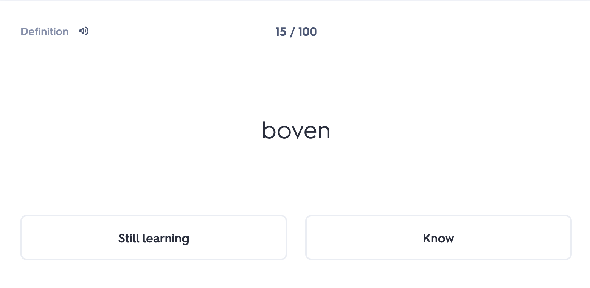
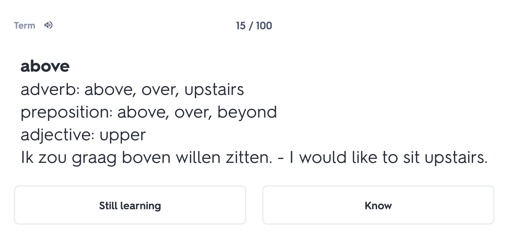

# LearningDutch

There are no good applications for Dutch verbs that compare to those for conjugations of for example, Spanish. On apps like Anki and Quizlet, there are no flashcard lists that organise dutch verbs by their frequency of usage (https://en.wiktionary.org/wiki/Wiktionary:Frequency_lists/Dutch_wordlist)

This is an ongoing project, initially to create CSVs to be used with a 3rd party flashcard application (Quizlet), and eventually to develop a tailor made set of applications for learning Dutch that cater to the needs of expats wanting to rapidly acquire Dutch (or any other language)

